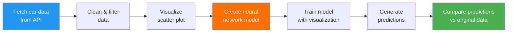

<p align="center">
  <h1 align="center">tensorflow_practise_app</h1>
  <p align="center">
    A TensorFlow.js tutorial app that trains a linear regression model in the browser to predict MPG from car horsepower — with interactive visualizations.
  </p>
</p>

<p align="center">
  <a href="https://github.com/girijashankarj/tensorflow_practise_app"></a>
  
  
  
  
</p>

---

## Table of Contents

- [Overview](#overview)
- [Features](#features)
- [Tech Stack](#tech-stack)
- [Quick Start](#quick-start)
- [How It Works](#how-it-works)
- [Project Structure](#project-structure)
- [Contributing](#contributing)
- [License](#license)

---

## Overview

**tensorflow_practise_app** is an educational project that demonstrates machine learning in the browser using TensorFlow.js. It fetches car data from an API, trains a neural network to learn the relationship between horsepower and MPG (miles per gallon), and visualizes both the training process and predictions — all in a single HTML file.

---

## Features

- **In-browser ML** — no server-side computation required
- **Data fetching** — loads car data from Google Cloud Storage API
- **Data cleaning** — filters and normalizes raw data
- **Scatter plot** — interactive Horsepower vs MPG visualization
- **Neural network** — sequential model with dense layers
- **Training visualization** — real-time loss/metrics charts
- **Predictions** — model predictions overlaid on original data
- **Min-max normalization** — proper data scaling

---

## Tech Stack

|                  | Details                              |
| ---------------- | ------------------------------------ |
| **ML Library**   | TensorFlow.js v1.0 (CDN)            |
| **Visualization**| TensorFlow.js Vis v1.0 (CDN)        |
| **Language**      | Vanilla JavaScript                   |
| **Data Source**   | Google Cloud Storage JSON API        |
| **Build Tool**   | None — runs directly in browser      |

---

## Quick Start

```bash
git clone https://github.com/girijashankarj/tensorflow_practise_app.git
cd tensorflow_practise_app
```

Open `index.html` directly in your browser — no build step required.

> The app fetches data from an external API, so an internet connection is needed.

---

## How It Works



| Step                  | Description                                           |
| --------------------- | ----------------------------------------------------- |
| **Data loading**      | Fetches car dataset from Google Cloud Storage         |
| **Data cleaning**     | Filters out entries with missing horsepower/MPG       |
| **Visualization**     | Renders scatter plot using tfjs-vis                   |
| **Model creation**    | Sequential model with dense layers (input → hidden → output) |
| **Training**          | Trains with loss visualization using `model.fit()`    |
| **Prediction**        | Generates predictions and compares to original data   |
| **Normalization**     | Min-max scaling for input/output tensors              |

---

## Project Structure

```
tensorflow_practise_app/
├── index.html          # Main HTML file (CDN imports for TF.js)
├── script.js           # Complete ML pipeline implementation
└── README.md
```

---

## Contributing

1. **Fork** the repository
2. **Create** a feature branch: `git checkout -b feature/my-feature`
3. **Make** your changes
4. **Commit** and open a Pull Request

---

## License

This project is open source. See the [LICENSE](LICENSE) file for details.

---

<p align="center">
  Built with discipline by <a href="https://github.com/girijashankarj">GarryTJ</a>
</p>
